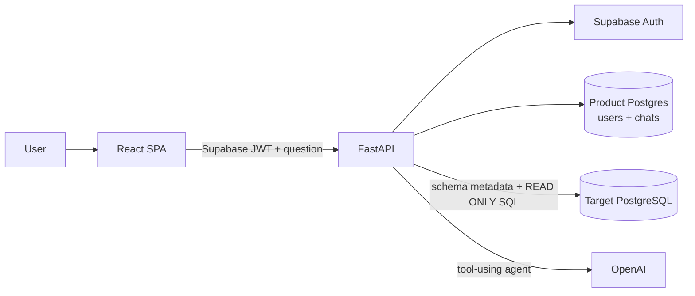

# Database Copilot Architecture

## Purpose

Database Copilot lets an authenticated user ask business questions in natural
language. The backend inspects a configured PostgreSQL database, combines that
metadata with human-written business definitions, generates read-only SQL, runs
it, and returns an explanation plus the exact SQL and rows.

## Services

The product database and target analytics database are separate connections.
`DATABASE_URL` owns application migrations and retrieval of legacy product data.
`TARGET_DATABASE_URL` is used only by the database assistant.

## Turn flow

1. FastAPI verifies the user's Supabase token and thread ownership.
2. The database agent calls `get_database_context`.
3. The tool reads configured schemas from `information_schema` and appends
   `backend/database_description.md`.
4. The agent generates PostgreSQL and calls `run_readonly_query`.
5. The backend validates the statement shape, starts a `READ ONLY` transaction,
   applies a statement timeout, executes it, reads at most `QUERY_MAX_ROWS`, and
   rolls back the transaction.
6. The result is registered for the current turn. The final structured answer
   must reference that exact `query_id`; otherwise validation fails closed.
7. FastAPI streams answer text and a `data-query-result` part to the SPA, then
   stores both in `chat_messages.parts`.

## Safety boundary

Application checks are defense in depth, not a substitute for database grants.
The target connection must use a dedicated PostgreSQL role with:

- `CONNECT` on the target database
- `USAGE` only on approved schemas
- `SELECT` only on approved tables or views
- no write, DDL, function execution, or role-management privileges

The app additionally permits one statement beginning with `SELECT`, `WITH`,
`EXPLAIN`, or `SHOW`. PostgreSQL's read-only transaction blocks write operations
hidden inside otherwise plausible SQL.

## Schema and semantic context

`TARGET_DATABASE_SCHEMAS` is a comma-separated allowlist used by introspection.
The generated context includes tables, ordered columns, nullability, defaults,
and foreign-key relationships.

`backend/database_description.md` supplies semantics that cannot be inferred from
DDL: metric definitions, valid status filters, join rules, timezone conventions,
and known data-quality limitations. It contains no credentials.

## Frontend contract

Assistant messages contain:

- a normal text part with the explanation
- an optional `data-query-result` part with `queryId`, `sql`, `columns`, `rows`,
  `rowCount`, `truncated`, and `elapsedMs`

The UI renders the query result as a scrollable table and lets the user reveal
and copy the SQL. Authentication, thread navigation, streaming, and persistence
remain unchanged.
